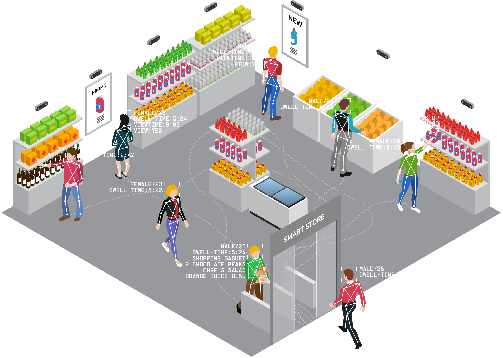

# Timeline API Task

## Background information

Advertima is creating the Smart Store to enable a seamless retail shopping experience - from check-in, to product selection, to check-out without friction and human involvement. The core technology which enables that experience is computer vision.



Video sensors scattered throughout the Store feed streams of  information to Edge devices near them. These devices are powerful  enough to run Machine Learning (ML) algorithms on the received video data. The algorithms are able to extract  information about the actions of humans in the footage. The Edge devices then send this information to various services for further processing.

Among these services is the timeline API. This arranges events detected by individual edge devices into a complete user journey. Other services will then be able to track users as they move through, and interact with, the Store.

The Human Review Console (HRC), for example, uses this timeline information. The HRC is an application that allow operators to inspect the information extracted by the ML algorithms and correct it if necessary.

In this exercise we will create a simplified version of the timeline API.

## API Description

In the Human Review Console for Smart Store, we want to display the cameras that saw the person within some time range. To do so, we want to implement a service that receives notifications about people entering and leaving fields of view of store cameras and generates for each person a 'timeline,' a list of intervals with camera ID lists.
Your API must implement the following endpoints:

* `GET /`: is used by the acceptance tests to check the API readiness.
  Response code: 200 if your service is up and running.

* `POST /enter_event`: this tells the service that the person entered the camera's field of view. The event data must be stored in the database.
  The request body is a JSON object with the following fields
  ```javascript
  {
    event_id: str,
    timestamp: int, // Unix timestamp
    camera_id: str,
    tracking_id: str
  }
  ```
  Response code: 201 if the event was saved successfully

* `POST /exit_event`: this tells the service that the person left the camera's field of view. The event data must be stored in the database.
  The request body is a JSON object with the following fields
  ```javascript
  {
    event_id: str,
    timestamp: int, // Unix timestamp
    camera_id: str,
    tracking_id: str
  }
  ```
  Response code: 201 if the event was saved successfully

* `GET /timeline/{tracking_id}`: this retrieves the enter and exit events with corresponding `trackind_id` and constructs the timeline.
  Response code: 200
  Response body is an array of JSON objects
  ```javascript
  [
    {
      start_ts: int, // Unix timestamp
      end_ts: int, // Unix timestamp
      camera_ids: str[],
    },
    ...
  ]
  ```
  As an example: the object `{start_ts: 10, end_ts: 20, camera_ids: ["5", "6"]}` tells us that the cameras 5 and 6 saw the person in the time interval `[10, 21)` (note that the end of the interval is 21 and not 20; this means the whole 20th second is included in the interval).
  Requirements:
  * The list must be sorted by `start_ts`.
  * Time ranges must have no overlaps, i.e., if some entry has `end_ts=15`, the next entry must have `start_ts>=16`.
  * Entries with empty `camera_ids` must be removed from the list.
  * Adjacent entries (i.e., `res[i].end_ts + 1 == res[i + 1].start_ts`) with the same `camera_ids` must be joined.
  * You should ignore exit events without the corresponding enter events and enter events without the exit events.

### Example

Consider the following diagram of a customer's journey in the store
```text
Time     0         10        20        30        40
         |         |         |         |         |
Camera 1 >------------------->
Camera 2           >----------------------------->
```
The customer entered the field of view of the camera 1 at the second 0 and left it at the second 20.
And she entered the field of view of the camera 2 at the second 10 and left it at the second 40.
The corresponding enter and exit events can be created as follows:
``` sh
curl -H "Content-Type: application/json" \
  -X POST -d '{"timestamp": 0, "camera_id": "1", "tracking_id": "track1", "event_id": "clFZgt1"}' \
  http://localhost:8000/enter_event

curl -H "Content-Type: application/json" \
  -X POST -d '{"timestamp": 10, "camera_id": "2", "tracking_id": "track1", "event_id": "clFZgt2"}' \
  http://localhost:8000/enter_event

curl -H "Content-Type: application/json" \
  -X POST -d '{"timestamp": 20, "camera_id": "1", "tracking_id": "track1", "event_id": "clFZgt3"}' \
  http://localhost:8000/exit_event

curl -H "Content-Type: application/json" \
  -X POST -d '{"timestamp": 40, "camera_id": "2", "tracking_id": "track1", "event_id": "clFZgt4"}' \
  http://localhost:8000/exit_event
```

And the expected timeline for `track1` is
```sh
$ curl -i http://localhost:8000/timeline/track1
HTTP/1.1 200 OK
date: Wed, 18 Aug 2021 15:15:55 GMT
content-length: 144
content-type: application/json

[
  {"start_ts":0,"end_ts":9,"camera_ids":["1"]},
  {"start_ts":10,"end_ts":20,"camera_ids":["1","2"]},
  {"start_ts":21,"end_ts":40,"camera_ids":["2"]}
]
```

## Instructions

1. Implement your service as a Docker container in `timeline_service/`.
   * The container is expected to listen on the port 8000.
   * If you want to use a non-embedded database you need add you DB container to `docker-compose.yml`.
   * You may use the provided service templates:
      * Python, FastAPI, SQLAlchemy, SQLite:
      ```sh
      cp python_template/* timeline_service/
      ```
      * TypeScript, Express, Knex, SQLite:
      ```sh
      cp typescript_template/* timeline_service/
      ```
    But feel free to use the stack you are most comfortable with.
2. Run the acceptance tests and make sure the tests pass.
  ```sh
  ./run_acceptance_tests.sh
  ```
3. Send your code in an archive.

## Bonus points

1. Consider implementing error handling. What response codes would you use?
2. How would you test your code? Note that the provided tests do not cover all corner cases.

## Calendar & misc

Feel free to contact us at any point in time during this task execution.
It is a flexible request, we expect you to make assumptions and take decisions based on them. Make sure you clearly state your assumptions in case you make any.

We suggest a maximum of 1 calendar week to execute the task with an estimated investment time of 4 to 6 hours. This can be adjusted depending on your current time availability.

#### Happy solving!


> **Note to the maintainers of this repo** This repo is generated from an original in Gitlab. Please do not edit this repo directly, but edit the original and then merge
